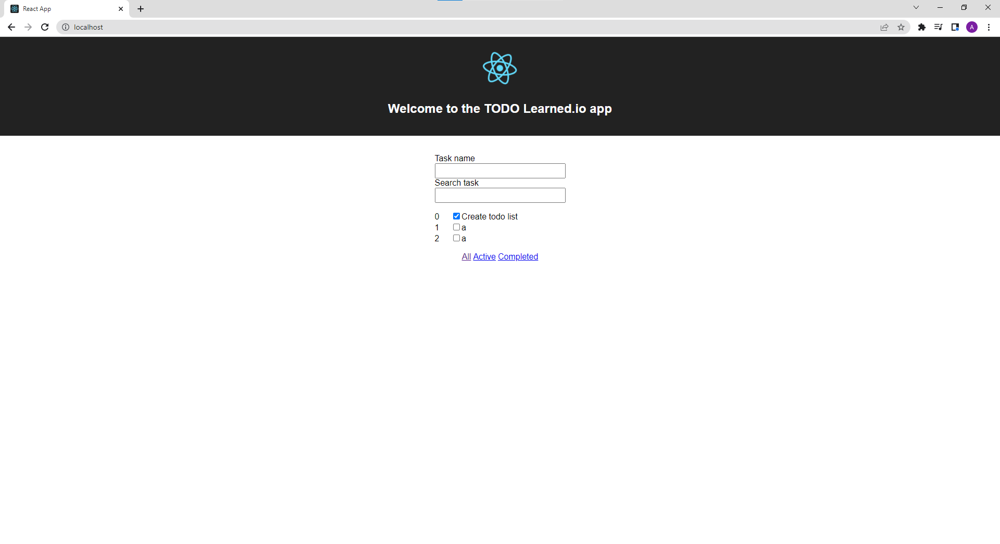

# Before start 

This project is made by two services: client & server. To start the proyect we will need:
- Docker, install windows version [here](https://docs.docker.com/desktop/install/windows-install/)
- Skaffold, install windows version [here](https://skaffold.dev/docs/install/#). You will to update your env variables after downloadin the `.exe` 
- Node.js. [Install](https://nodejs.org/en/download/)
- npm. It will be installed with Node.js

## Getting started

Once we have all our dependencies installed, we need to create our Docker images, to do so, we have to go to heach service
folder:

### Server service:

Once in `learned-todo` folder:

`cd server`

and then

`Docker build -t <your_repository_name/image_name>`

The repository name could be your Docker user, and the image name is a random name, for example:

`Docker build -t anthonyla/server-todo`

Once the image is build we can push it to our local Docker context:

`Docker push anthonyla/server-todo`

Now we need to build the image for the client service. Get back to the `learned-todo` folder:

`cd .. && cd client`

and then

`Docker build -t <your_repository_name/image_name>`

The repository name could be your Docker user, and the image name is a random name, for example:

`Docker build -t anthonyla/client-todo`

Once the image is build we can push it to our local Docker context:

`Docker push anthonyla/client-todo`

With the images already build, we can start our project. It's important to be placed in `learned-todo` folder:

`skaffold dev`

This will load and launch the `infra/k8s/ingress-serv.yaml` configuration.

Now you can go to your browser and type in the URL: `localhost`

This will show the TODO app:

# The application

If you want to create a new item, you have to type inside the first input and hit enter.

The second input is for filtering the list.

You could delete each item individualy and mark it complete or incomplete. At the end of the list you will find some filter based on the status.

# Task completed
Create TODO list, so it has all the following features:
- user see the list of tasks: (columns: No, Title, Status(done/not done)). By default list has
only 1 task: (title “Create todo list”, status: done); ✅
- user should be able to add new task to the list; ✅
- user should be able to delete any task from the list; ✅
- user should be able to search through the tasks (by name); ✅
- user should be able to mark task as done or not done; ✅
- when a user creates a new task - the name of the task should be proposed randomly. ❌
For random task name use:
- service from Back-end (Node.js | Express) part: fetch random task name.
- or https://www.boredapi.com/api/activity (if you do not do Back-end (Node.js | Express)
part).

Back-end (Node.js | Express)
Rules:
- code should be located in repository (For instance: GitLab);
- implement a project using Node.js | Express.
- feel free to use any additional packages you need.
- demonstrate/reveal all your knowledge in project implementation.
(p.s. store list of task names in server memory, you do not need database for this)
Service: fetch random task name.
Create API using Node.js and Express with next functionality:
- add new task name in the list; ✅
- get random task name from the list; ✅
- delete all task names from the list; ❌

